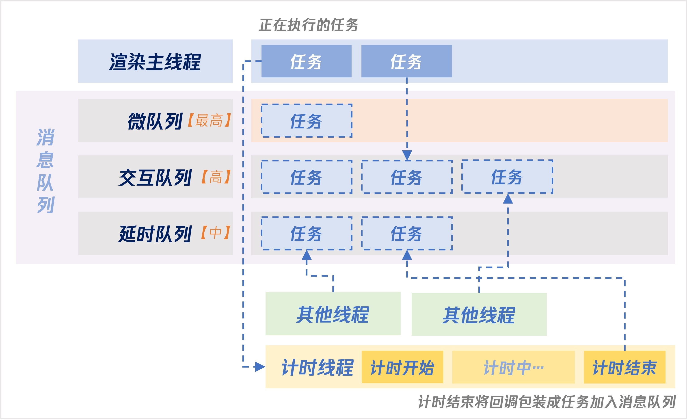

# 事件循环

事件循环，在W3C中描述为 `Event Loop`，Chrome的实现源码中定义为 `Message Loop`，因此事件循环也称为消息循环，是**浏览器渲染主线程**的工作方式。


## 1. 浏览器的进程模型

浏览器是一个多进程多线程的应用程序，核心的进程是**浏览器进程**、**网络进程**、**渲染进程**

**浏览器进程**：负责浏览器软件的UI界面显示、用户交互、子进程管理等。浏览器进程内部会启动多个线程处理不同任务。

**网络进程**：负责加载网络资源。

**渲染进程**：(重点) 渲染进程启动后，会开启一个**渲染主线程**，主线程负责执行 HTML、CSS、JS。默认情况下，浏览器会为每个标签页开启一个**新的渲染进程**，以保证标签页隔离 (未来可能改为一个站点一个进程)。


## 2. 渲染主线程的异步处理

渲染主线程是浏览器中最繁忙的线程，处理的任务包括但不限于：

+ 解析 HTML
+ 解析 CSS
+ 计算样式
+ 布局
+ 处理图层
+ 帧绘制
+ 执行全局 JS 代码
+ 执行事件处理函数
+ 执行计时器的回调函数
+ ......

JS运行在浏览器的单个渲染进程的渲染主线程中，而渲染主线程只有一个！注意，js的单线程，是因为执行在浏览器的渲染主线程，并不代表浏览器是单进程/线程的。

因此，JS是一门 **单线程** 的语言，浏览器采用异步而非同步的方式来避免阻塞，如计时器、网络、事件监听。

主线程将任务交给其他线程处理，完成后将事先传递的回调函数包装成任务，加入到消息队列的末尾排队，等待主线程调度执行。

**总结**：

1. **单线程是异步产生的原因**

2. **事件循环是异步的实现方式**


**异步的场景**：`setTimeout`、`setInterval`、`XHR`、`Fetch`、`addEventListener` 等




## 3. JS 阻塞渲染

如下面的案例，虽然 h1 已经设置了 text 内容，但会在 3s 后才显示，因为 **JS执行和渲染都在浏览器的渲染主线程上执行**，在执行了 h1 内容设置后，向消息队列(message queue)中插入了新的渲染任务，但需要在 delay 完成后，渲染主线程才会执行渲染。

```javascript
var h1 = document.querySelector(...);
var btn = document.querySelector(...);

// 死循环一段时间
function delay(duration) {
	var start = Date.now();
  while(Date.now() - start < duration) {}
}

btn.onclick = function() {
  h1.textContent = 'xxx';
  delay(3000);
}
```


## 4. 任务没有优先级，但消息队列有优先级

每个任务都有一个任务类型，同一类型的任务必须在一个队列，一个队列可能有多种类型的任务，在一次事件循环中，浏览器可以根据实际情况从不同的队列中取出任务执行。

浏览器必须准备好一个**微队列**(microTask)，微队列中的任务优先于所有其他任务执行。

随着浏览器复杂度急剧提升，W3C不再使用宏队列的说法。

目前 chrome 中至少包含了以下队列：

+ **微队列**：[最高] 存放需要最快执行的任务  
+ **交互队列**：[高] 存放用户交互后产生的事件处理任务
+ **延时队列**：[中] 存放定时器回调

添加任务到微队列的方式主要为：`Promise`、`MutationObserver`，如

```javascript
// 立即添加函数到微队列
Promise.resolve().then(函数)
```

案例：

```javascript
function delay(duration) {
	var start = Date.now();
  while(Date.now() - start < duration) {}
}
setTimeout(function() { // 添加到延迟队列
  console.log(1);
}, 0);
Promise.resolve().then(function() { // 添加到微队列
  console.log(2);
});
delay(1000); // 死循环1s
console.log(3); // 当前任务中执行
// 1s 后输出 3 2 1
```


