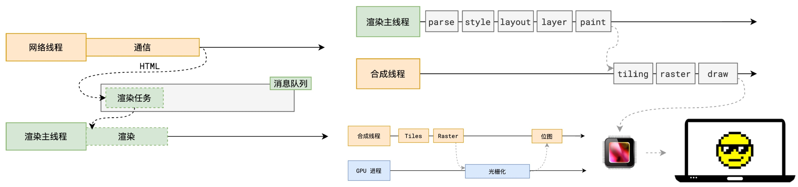
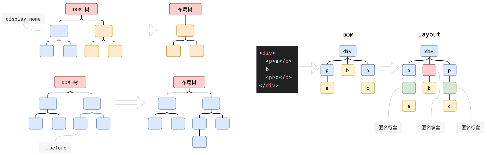
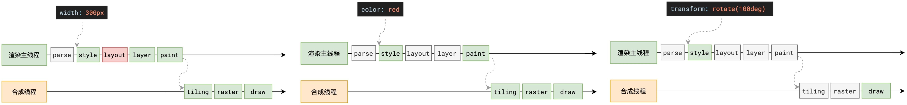

# 浏览器渲染原理

## 1. 渲染过程



### 1.1 【解析 HTML】 为 DOM 和 CSSOM

首先解析 HTML，解析过程中遇到 CSS 解析 CSS，遇到 JS 执行 JS。为提高解析效率，浏览器在开始解析前，会启动一个预解析线程，率先下载 HTML 中的外部 CSS 文件和 JS 文件。

若主线程解析到 link 位置时 CSS 文件还未下载解析完成则会跳过。因为下载和解析 CSS 是在预解析线程中进行的，所以 **CSS 不会阻塞渲染主线程对 HTML 的解析**。

主线程解析到 script 位置时会停止解析 HTML，等待 JS 文件下载结束，并将全局代码解析执行完成后，才继续解析 HTML。这是因为 JS 代码的执行过程可能会修改当前的 DOM 树，所以 DOM 树的生成必须暂停，所以  **JS 会阻塞渲染主线程对 HTML 的解析**。

解析 HTML 完成后，会得到 **DOM 树** 和 **CSSOM 树**，浏览器的默认样式、内部样式、外部样式、行内样式均会包含在 CSSOM 树中。

### 1.2 【样式计算】得到带样式的 DOM

主线程会遍历得到的 DOM 树，依次为树中的每个节点计算出最终样式，称之为 **Computed Style**。在此过程中，很多预设值会变成绝对值，比如 red 会变成 rgb(255,0,0); 相对单位会变成绝对单位，比如 em 会变成 px。

样式计算完成后，会得到一棵带有样式的 DOM 树。

> js 操作 stylesheet
>
> ```javascript
> document.styleSheets
> getComputedStyle(document.body)
> ```

### 1.3 【布局】生成 layout 布局树

布局阶段会依次遍历 DOM 树的每一个节点，计算每个节点的几何信息，如节点的宽高、相对包含块的位置。

大部分时候，DOM 树和布局树并非一一对应。比如 `display:none` 节点不会生成到布局树；比如使用了伪元素选择器，虽然 DOM 树中不存在这些伪元素节点，但它们拥有几何信息，所以会生成到布局树中；还有匿名行盒、匿名块盒等等都会导致 DOM 树和布局树无法一一对应。



### 1.4 【分层】

主线程会使用一套复杂的策略对整个布局树进行分层。分层会影响后续的布局树变化的处理，当某层变动只改某层能提升性能，但层次过多也会消耗性能。滚动条、堆叠上下文、transform、opacity 等样式都会或多或少的影响分层结果，可以通过 `will-change` 属性更大程度的影响分层结果，如在css中添加 `will-change: transform` 属性告诉浏览器将来 transform 可能变化，由浏览器决定是否分层。

### 1.5 【绘制】生成绘制指令集传递给合成线程

主线程会为每个层单独生成绘制指令集，完成后主线程将每个图层的绘制信息提交给合成线程，剩余工作将由合成线程完成。

### 1.6 【分块】合成线程分块

合成线程首先将每个图层划分为更多的小区域，它会从线程池中拿取多个线程来完成分块工作。

### 1.7 【光栅化】GPU光栅化

合成线程会将块信息交给 GPU 进程，GPU 进程会开启多个线程极速完成光栅化，得到一块一块的位图，默认会优先处理靠近视口区域的块。

### 1.8 【draw】合成线程根据位图生成指引并由GPU绘制到屏幕

合成线程拿到每个层、每个块的位图后，生成一个个"指引(quad)"信息，用于标识出每个位图在屏幕的绘制位置，以及旋转、缩放等变形的处理。

由于 `transform` 变形发生在合成线程，与渲染主线程无关，所以效率高。

最后合成线程会把 quad 提交给 GPU 进程，由 GPU 进程产生系统调用，提交给 GPU 硬件，完成最终的屏幕成像。


## 2. transform 高效的原因

如前面说述，transform 既不影响布局也不影响绘制指令，只影响渲染流程最后的绘制阶段。由于 draw 阶段在合成线程中，所以 transform 的变化几乎不会影响忙碌的渲染主线程。


## 3. reflow(重排) & repaint(重绘)

`reflow`：当进行了影响布局树的操作后，需要重新计算 layout 布局树。浏览器会合并布局属性的修改操作，当 JS 代码全部完成后再异步统一计算。但为了让  JS 获取布局属性时取到最新的布局信息，在获取属性时会立即 reflow。

`repaint`：当修改了可见样式后需要重新计算绘制指令。

由于元素的布局信息也属于可见样式，所以 **reflow 一定会引起 repaint**，要尽量减少 reflow。


