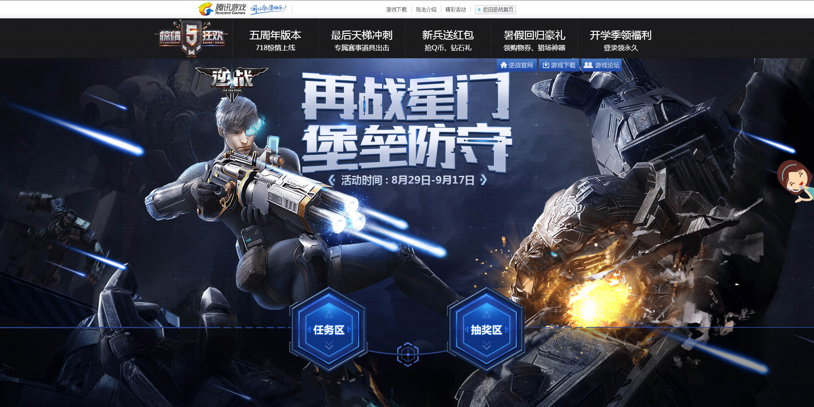
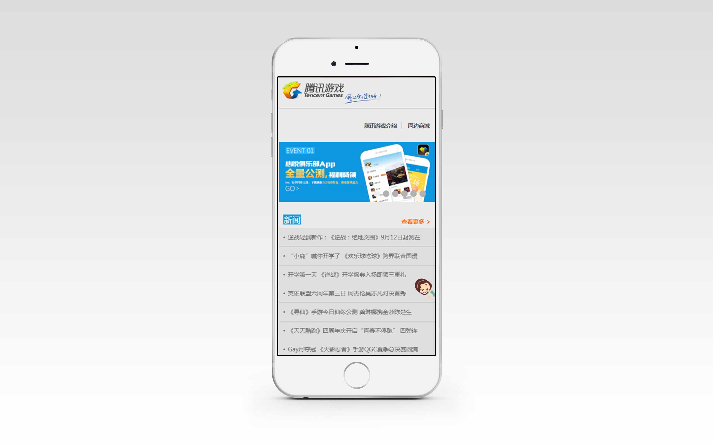
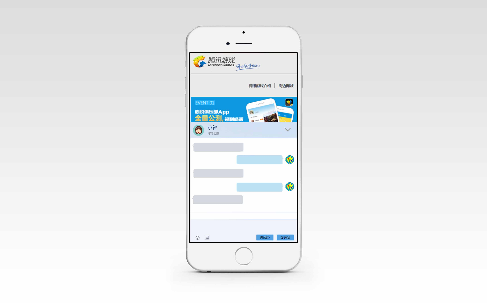

# 小智客服设计

## 1 效果图

效果图01

效果图02

效果图03

效果图04

## 2 特性

1. 即插即用，仅需引入一个js文件，即可实现效果
2. 使用websocket，实现数据的 pull，push
3. 区分PC端和移动端，加载不同样式
4. 其他特色功能：用户画像、战报数据推送……

## 3 支持的消息数据类型

1. 文本
2. 图片（二进制 base64）
3. 表情（正则替换）

## 4 技术选型

### 4.1 前端

1. 使用 webpack 构建
2. react 实现组件化和模板渲染
3. bootstrap 快速搭建 UI

### 4.2 后端

1. nodejs (首选)
2. go

## 5 数据处理

### 5.1 数据流

（聊天和推送数据是否存入数据库）

### 5.2 数据结构

（图片文件的处理）

### 5.3 数据额外处理

1. 敏感信息过滤
2. 表情包正则替换