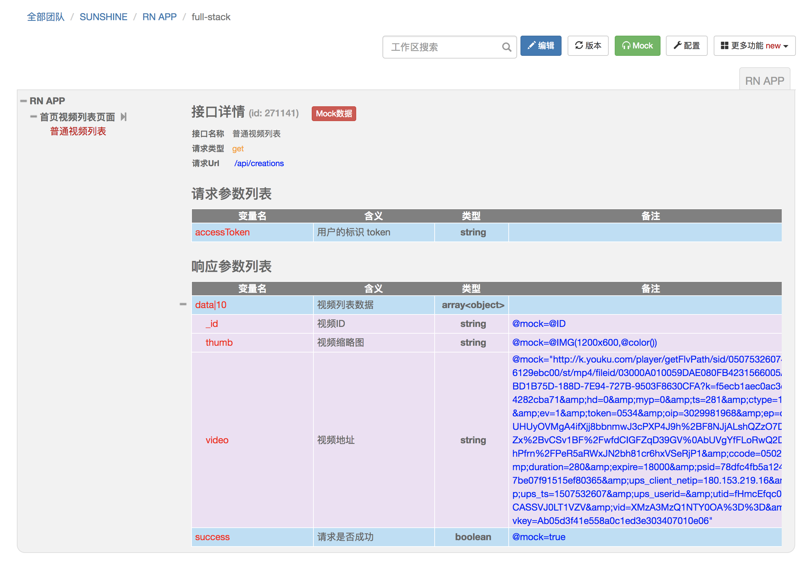
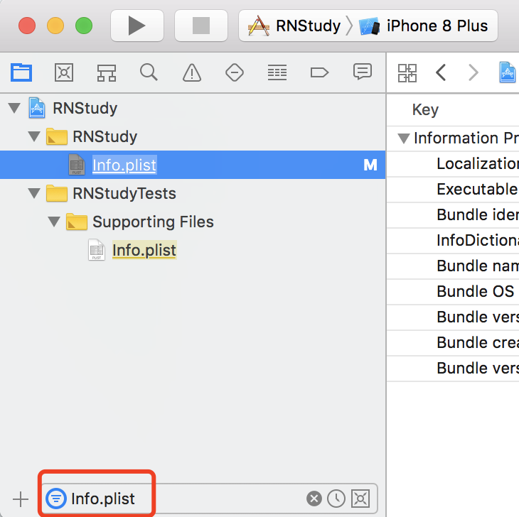

# react-native 学习笔记

By CS逍遥剑仙  2017.09.21

## 1 基础环境配置

**1.1 安装基础环境： `homebrew`、`watchman`、`flow`、`nodejs` 等**

`watchman`: 监视文件，记录改动情况

`flow`: js静态类型检查器

```shell
# 安装相关依赖包
$ brew install watchman flow git gcc pkg-config cairo libpng jpeg gitlib mongodb
# 安装相关环境
......
```

**1.2 安装 `xcode`**

```Shell
$ xcode-select --install
```

**1.3 几个相关的sublime插件**

`babel`、`sublimelinter-jsxhint` (view->syntax->babel->javascript)、`gitgutter`、`sublimelinter-contrib-eslint`

**1.4 修改 npm 下载源**

使用淘宝的 `npm` 下载源, 可以加快下载速度

```Shell
$ npm config set registry=http://registry.npm.taobao.org/
```

配置地址在根目录的 `.npmrc` 中, 即

```config
registry=http://registry.npm.taobao.org/
```

## 2 开发环境配置

**2.1 安装 `react-native`**

```Shell
$ npm install -g react-native-cli@0.1.10 -g
```

**2.2 新建项目**

```Shell
$ react-native init RNStudy
$ react-native run-ios
$ react-native run-android
```

**2.3 版本控制**

版本回退

```
npm install --save react-native@0.24
react-native upgrade
```

使用 `rninit` 指定版本

```
npm i -g rninit
```

**2.4 配置安卓**

在项目下的 `android/` 文件夹内创建 `local.properties` :

```config
sdk.dir = /Users/USERNAME/Library/Android/sdk
```

或添加系统环境变量

```config
export ANDROID_HOME=/Users/<username>/Library/Android/sdk/
export PATH=$PATH:$ANDROID_HOME/tools:$ANDROID_HOME/platform-tools
```

**2.5 使用 debugger-ui 在浏览器中调试**

呼出方式：`cmd`+`d`

浏览器访问地址：http://localhost:8081/debugger-ui

**2.6 手机端展示原型**

1. iPhone连接Mac，确保处在同一WiFi下

2. 找到本地IP地址并修改ios项目的ip地址

   ```Shell
   $ ifconfig
   ......
   ```

3. IOS11 需要 sign team

   

4. xcode中选择并启动模拟器

## 3 RN知识点

**3.1 RN 生命周期**


**3.2 查看官方 demo**

```Shell
$ git clone https://github.com/facebook/react-native.git
$ cd react-native
$ git checkout 0.24-stable
$ rm -rf node_modules && npm install
```

通过xcode启动Example/UIExplorer，查看组件

> 新版本改名为 RNTester

**3.3 常用组件**

`View`、`Text`、`TextInput`、`Image`、`AlertIOS`、`Modal`、`ActivityIndicatorIOS`、`ProgressViewIOS`、`ListView`、`PickerIOS`、`DatePickerIOS`、`StatusBarIOS`、`Switch`、`Slider`、`MapView`、`Navigator`、`TabBarIOS`、`SegmentedControlIOS`、`Touchable`、`WebView`

## 4 Mock 假数据

**4.1 使用 rap 配置返回数据规则**

[http://rapapi.org](http://rapapi.org) rap 配置规则



**4.2 解决 Image 网络图片不显示问题**

IOS 9以上的设备因为`App Transport Security`会拒绝所有不通过HTTPS发送的HTTP请求，需要在`Info.plist`进行ATS设置，`App Transport Security Settings`下新建`Allow Arbitrary Loads`条目，并设置值为`YES`




**4.3 使用 mockjs 解析数据**

[http://mockjs.com](http://mockjs.com) 解析 json

```Shell
#  安装 mockjs
$ npm install mockjs --save
```

**4.4 删除 mockjs 中 dataImage 方法**

```
路径: node_modules/mockjs/dist/mock.js
```

**4.5 配套安装 query-string & lodash**

```Shell
$ npm install query-string --save
$ npm install lodash --save
```

## 5 实战开发 

**5.1 TabBarIOS组件**

**5.2 使用 rnpm 链接图标库组件**

```Shell
# 安装图标库
$ npm install react-native-vector-icons@2.0.2 --save
# 安装rnpm
$ npm install rnpm@1.7.0 -g
# 链接
$ rnpm link react-native-vector-icons
```

**5.3 navigator**

通过 push 和 pop 页面，实现页面的跳转

```Shell
# 报错解决:Navigator is deprecated and has been removed from this package. It can now be installed and import from ‘react-native-deprecated-custom-components’ instead of ‘react-native’.
$ npm i react-native-deprecated-custom-components --save
```

**5.4 视频播放组件**

```Shell
$ npm i -S react-native-video
$ react-native link
$ rnpm link react-native-video
```

**5.5 按钮组件**

```Shell
$ npm i react-native-button --save
```

**5.6 本地异步存储 - AsyncStorage**

**5.7 倒计时组件**

```Shell
$ npm install react-native-sk-countdown --save
```

