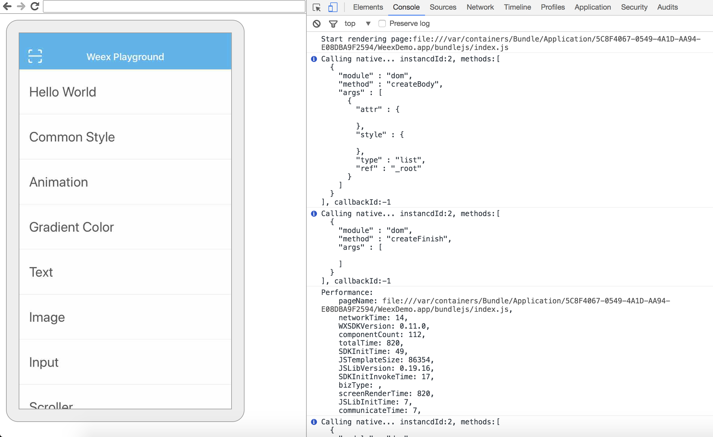

# weex 踩坑笔记
[toc]
> Write By CS逍遥剑仙  
> 我的主页: [www.csxiaoyao.com](http://www.csxiaoyao.com)  
> GitHub: [github.com/csxiaoyaojianxian](https://github.com/csxiaoyaojianxian)  
> Email: sunjianfeng@csxiaoyao.com  
> QQ: [1724338257](wpa.qq.com/msgrd?uin=1724338257&site=qq&menu=yes)  

## 1. 基本说明
weex工作流程

官网：
[http://weex.apache.org/cn/](http://weex.apache.org/cn/)
Playground：
[http://dotwe.org/vue](http://dotwe.org/vue)
WeexUI
[https://github.com/alibaba/weex-ui](https://github.com/alibaba/weex-ui)

## 2. weex-toolkit的使用
weex-toolkit是官方提供的weex开发脚手架工具(新版已经整合weexpack)，可以实现构建项目、调试、打包等全套操作
### 2.1 配置入口js文件
weex-toolkit脚手架会根据src下的index.vue文件产生一个对应的js文件放到demo目录下，但传统的vue开发一般有个入口文件(main.js或entry.js)用来导入其他模块，进行页面总体配置等操作，可以通过修改webpack.config.js文件实现，**详细代码见我的github**
1. 添加入口文件配置
```
const entry = {index:pathTo.resolve('src','entry.js?entry=true')};
const weexEntry = {index:pathTo.resolve('src','entry.js?entry=true')};
```
2. 删除多余配置(可选)
删除`getEntryFileContent`函数、`walk`函数、`walk()`
3. 在src目录下添加 App.vue
4. 在src目录下添加入口文件`entry.js`，并删除temp目录
```
import App from './App.vue'
new Vue(Vue.util.extend({
	el:'#root'
},App))
```
5. 解决页面无法覆盖整个屏幕，简单修改`WXDemoViewController`原生代码
```
// _weexHeight = self.view.frame.size.height - 64;
_weexHeight = self.view.frame.size.height;
```
### 2.2 基本命令
> 【默认配置的 npm script】
init: 初始化weex项目
build: 源码打包，生成 JS Bundle
dev: webpack watch 模式，方便开发
serve: 开启静态服务器
debug: 调试模式
```
$ npm install -g weex-toolkit
$ weex init weexdemo
$ cd weexdemo
$ npm install
# 开启 watch 模式和静态服务器，进入 http://localhost:8080/index.html
$ npm run dev & npm run serve
# 调试
$ weex debug
# 安装ios平台和依赖
$ weex platform add ios
$ cd platforms/ios
$ pod install
# 运行并启动模拟器
$ cd ../..
$ weex run ios
$ weex platform add android
$ weex run android
```
### 2.3 开发调试方式
1. 使用传统 vue 开发方式开发页面
2. 浏览器实时刷新调试
```
$ npm run dev & npm run serve
```

> 注意：weex默认宽度750px，所以需要调整窗口宽度为750px

3. 使用移动端官方App-WeexPlayground扫码进入移动端远程调试模式


进入Debugger，用于打印log

进入Inspector，用于审查元素


## 3. 集成SDK
为了最终把打包jsbundle打包进原生App，需要集成SDK
### 3.1 集成 iOS SDK
#### 3.1.1 使用 ios/playground
```
$ pod install --no-repo-update
```
#### 3.1.2 修改DemoDefine.h文件
1. 修改
```
#define HOME_URL [NSString stringWithFormat:@"http://%@:12580/examples/build/index.js", DEMO_HOST]
```
为
```
#define HOME_URL @"file:///Users/sunshine/Downloads/bundlejs/index.js"
```
2. 修改IP
```
#define CURRENT_IP @"192.168.0.1"
```
#### 3.1.3 去掉navigatebar
在WXDemoViewController.m中添加
```
self.navigationController.navigationBar.hidden = YES;
```
### 3.2 集成 Android SDK
#### 3.2.1 配置adb，`vi ~/.bash_profile`
```config
export ANDROID_HOME=/Users/sunshine/Library/Android/sdk
export PATH=${PATH}:$ANDROID_HOME/tools:$ANDROID_HOME/platform-tools:$ANDROID_HOME/build-tools
```
#### 3.2.2 基于wxsample打包jsbundle
1. 下载wxsample，`import project`根据错误提示修复(下载的时候注意关闭代理)
2. 直接`run`
3. 引入新的jsbundle
jsbundle文件路径：`app/src/main/assets/`
修改`LocalActivity.java`中的`hello.js`
4. 默认显示jsbundle的内容
默认页提供了本地加载、网络加载、framework三种方式，修改`AndroidManifest.xml`
```
<activity android:name=".IndexActivity">
</activity>
<activity android:name=".LocalActivity">
    <intent-filter>
        <action android:name="android.intent.action.MAIN"/>
        <category android:name="android.intent.category.LAUNCHER"/>
    </intent-filter>
</activity>
<activity android:name=".NetworkActivity">
</activity>
```
5. 去掉顶部的ActionBar
修改`AndroidManifest.xml`
```
android:theme="@style/AppTheme.NoActionBar"
```
6. 允许下载图片
修改`ImageAdapter`，使用`alt+enter`修复找不到的包
```java
public class ImageAdapter implements IWXImgLoaderAdapter {
  public ImageAdapter() {
  }
  @Override
  public void setImage(final String url, final ImageView view,
                       WXImageQuality quality, WXImageStrategy strategy) {
    WXSDKManager.getInstance().postOnUiThread(new Runnable() {
      @Override
  public void run() {
        if(view==null||view.getLayoutParams()==null){
          return;
        }
        if (TextUtils.isEmpty(url)) {
          view.setImageBitmap(null);
          return;
        }
        String temp = url;
        if (url.startsWith("//")) {
          temp = "http:" + url;
        }
        if (view.getLayoutParams().width <= 0 || view.getLayoutParams().height <= 0) {
          return;
        }
        Picasso.with(WXEnvironment.getApplication())
                .load(temp)
                .into(view);
      }
    },0);
  }
}
```
其中`Picasso`需要在app的`build.gradle`中添加依赖
```
compile 'com.squareup.picasso:picasso:2.5.2'
```
7. 打包apk
打包菜单选项：`Build->Build APK`
apk文件路径：`app/build/outputs/apk/app-debug.apk`

## 4. 使用weex-ui
```
$ npm i weex-ui -S
$ npm i babel-plugin-component -D
$ weex update weexpack
$ npm i babel-preset-stage-0 babel-plugin-component -D
```
修改 `.babelrc`
```
{
  "presets": ["es2015", "stage-0"],
  "plugins": [
    [
      "component",
      {
        "libraryName": "weex-ui",
        "libDir": "packages",
        "style": false
      }
    ]
  ]
}
```
## 5. 其他
### 5.1 vue和we
新版本的weex使用vue开发，最终得到vue文件，we文件是老版本的源码文件，推荐使用vue2.0开发

### 5.2 使用vue开发weex和传统vue开发的区别
[官方文档：Weex 和 Web 平台的差异](http://weex.apache.org/cn/references/platform-difference.html)

总结一下：
* **Weex 环境中没有 DOM**
  + 不支持 DOM 操作，原生平台没有 DOM 概念 [内建组件](http://weex.apache.org/cn/references/components/index.html)
  + 不支持 Web 中部分事件类型 [通用事件](http://weex.apache.org/cn/references/common-event.html)
  + 不区分事件的捕获阶段和冒泡阶段，相当于 DOM 0 级事件

* **Weex 环境中没有 BOM**
  + 没有 window 、screen 对象，可以通过 `WXEnvironment` 获取设备环境信息
  + 没有 document 对象，没有选择器方法
  + 没有 history 、location 、navigator 对象，有 [navigator 模块](http://weex.apache.org/cn/references/modules/navigator.html)

* **能够调用移动设备原生 API**
  + 通过模块调用设备原生 API，如 clipboard 、 navigator 、storage 等

### 5.3 Weex 对 CSS 样式的支持情况
[官方说明](http://weex.apache.org/cn/references/web-standards.html)

简单概括：
* 支持基本的盒模型
* 支持 `position` 定位布局
* 支持使用 `flexbox` 布局
* 限制
  + 只支持单个类名选择器，不支持关系选择器，也不支持属性选择器
  + 默认是组件级别的作用域，没有全局样式
  + 不支持样式继承（因为有作用域隔离）
  + 考虑到样式的数据绑定，样式属性暂不支持简写

### 5.4 weex对比react-native
1. react的JSX语法学习使用有一定的成本，vue更接近常用的web开发方式
2. 调试，weex支持在chrome中预览页面dom节点，ReactNative不支持
3. 页面开发，weex提供了一个playground，可以方便的预览正在开发的页面
，ReactNative需要建立一个native工程，然后编译运行
4. ReactNative官方只能将ReactNative基础js库和业务js一起打成一个js bundle，没有提供分包的功能，需要制作分包打包工具，weex默认打的js bundle只包含业务js代码，体积小很多，基础js库包含在weex sdk中
5. RN统一了IOS和Android两端，weex统一了IOS、Android、Web三端

### 5.5 安卓应用签名
打包的安卓apk还需要进行签名才能发布安装
1. 使用jdk的keytool命令生成keystore，参数-validity为证书有效天数
```bash
keytool -genkey -alias android.keystore -keyalg RSA -validity 100 -keystore android.keystore
```
2. 使用360签名工具签名，使用360加固宝加固
3. 上传到应用市场


